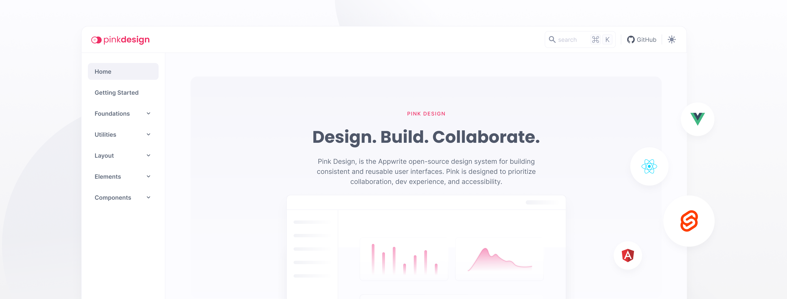

<br />
<p align="center">
    <a href="https://getapp-ui.khulnasoft.com" target="_blank"></a>
    <br />
    <br />
    <b>GetApp's open-source design system for building consistent and reusable user interfaces.</b>
    <br />
    <br />
    <a href="https://github.com/khulnasoft/getapp-ui"></a>
</p>

Getapp-ui Design is a CSS library designed for building accessible and visually appealing user interfaces. The library is built with a focus on accessibility, ensuring that users of all abilities can easily interact with your web application. Getapp-ui Design offers a wide range of classes and components that can be easily integrated into your project. Whether you're building a complex user interface or a simple web app, Getapp-ui Design has everything you need to create a polished and professional look.

## Getting Started

### NPM

Install the CSS library:

```bash
npm install "@khulnasoft/getapp"
```

After installing Getapp-ui Design as a package, include Getapp-ui Design as CSS library by importing it in your JavaScript files.

```js
import "@khulnasoft/getapp";
// optionally, add icons
import "@khulnasoft/getapp-icons";
```

### CDN

Copy the following code into the `<head>` section of your HTML file.

```html
<link rel="stylesheet" href="https://unpkg.com/@khulnasoft/getapp" />
<!-- optionally, add icons -->
<link rel="stylesheet" href="https://unpkg.com/@khulnasoft/getapp-icons" />
```

### Accessibility

Our design library is designed to be inclusive, making it easy for everyone to interact with and navigate, regardless of any unique needs they may have. This enhances the user experience for all and aligns with the ethical standards of web development. At GetApp, we are dedicated to fostering accessibility in all that we do.

We are constantly striving to improve. If you notice any areas where we can enhance accessibility, please do not hesitate to share your feedback and suggestions.

The [documentation website](https://getapp-ui.khulnasoft.com/) for Getapp-ui Design has been built with [Astro](https://astro.build/) web framework .

## Supported Browsers

| Browser            | Version |
| ------------------ | ------- |
| Chrome             | >=99    |
| Safari             | >=15.4  |
| Firefox            | >=97    |
| Opera              | >=85    |
| Chrome for Android | >=109   |
| Safari iOS         | >=15.4  |
| Samsung Internet   | >=18    |

## Contributing

All code contributions - including those from people with commit access - must go through a pull request and be approved by a core team member before being merged. This is to ensure a proper review of all the code.

We truly ❤️ pull requests! If you wish to help, you can learn more about how you can contribute to this project in the [contribution guide](CONTRIBUTING.md).

## Security

For security issues, kindly email us at [security@khulnasoft.com](mailto:security@khulnasoft.com) instead of posting a public issue on GitHub.

## Follow Us

Join our growing community around the world! See our official [Blog](https://medium.com/khulnasoft). Follow us on [Twitter](https://twitter.com/getapp), [Facebook Page](https://www.facebook.com/khulnasoft.com), [Facebook Group](https://www.facebook.com/groups/getapp.developers/), [Dev Community](https://dev.to/getapp) or join our live [Discord server](https://khulnasoft.com/discord) for more help, ideas, and discussions.

## License

This repository is available under the [MIT](./LICENSE).
